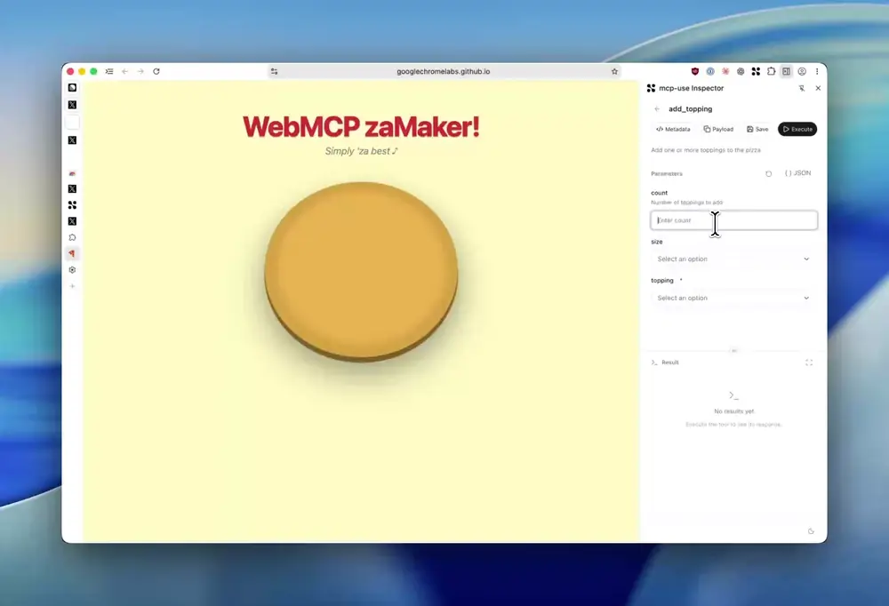

# WebMCP Inspector

A standalone Chrome side panel for inspecting and debugging WebMCP tools, using
copied mcp-use Inspector components. Built with WXT, React, TypeScript, and pnpm.

<!--
  Animated preview (assets/webmcp-inspector-demo.webp), generated from the original
  recording at assets/webmcp-inspector-demo.mp4, which stays in the repo.

  A real player with audio would need a <video> tag pointing at a GitHub attachment
  URL, e.g.:
      <video src="https://github.com/user-attachments/assets/<uuid>" controls></video>
  That URL can only be minted by dragging the .mp4 into a PR or issue comment - it
  cannot be derived from a path in the repo. Every <video> variant tried against a
  raw/blob/relative URL was removed by GitHub's markdown sanitizer.
-->


## Install

[](https://chromewebstore.google.com/detail/webmcp-inspector/dgdidjgjofcenipdfaoebdeeppideadh)

[Install WebMCP Inspector from the Chrome Web Store](https://chromewebstore.google.com/detail/webmcp-inspector/dgdidjgjofcenipdfaoebdeeppideadh).
See the [WebMCP Inspector documentation](https://docs.mcp-use.com/inspector/webmcp-inspector)
for setup details and troubleshooting.

1. Open a WebMCP-enabled website and click the extension toolbar icon.
2. Select a tool, enter parameters, and click **Execute** (or ⌘/Ctrl + Enter).

To install unpacked instead, download
[`webmcp-inspector.zip`](https://github.com/mcp-use/webmcp-inspector/releases/latest/download/webmcp-inspector.zip)
— the prebuilt extension from the latest release, refreshed on every merge to
`main`. Unzip it, open `chrome://extensions`, enable **Developer mode**, and
choose **Load unpacked** on the unzipped folder. To build it yourself, see
[Development](#development) below.

WebMCP is experimental. Enable **WebMCP for testing** in `chrome://flags` and
relaunch a compatible Chromium build if the API is unavailable. The extension
shell requires Chrome 116+, but this does not imply WebMCP support in Chrome 116.
Native end-to-end tests currently run against Chrome for Testing 149.0.7827.55.

## Features

- Inspector tool rows with descriptions, parameter counts, and search.
- Schema forms with enums, object/array JSON inputs, required markers, defaults,
  explicit empty values, and JSON Schema validation before execution.
- Raw JSON mode for complex inputs; metadata inspection and payload copying.
- Tool results with timing, errors, copy, a draggable split, and fullscreen mode
  within the side panel. The divider also supports keyboard arrow keys.
- Named saved requests stored locally and scoped to the website's origin.
- Automatic refresh on tool registration/removal events, tab changes, and page loads.
- Light/dark themes, persisted locally.

There is no MCP Apps rendering or remote MCP server connection.

## Page access and compatibility

The production manifest requests `sidePanel`, `activeTab`, `scripting`, and
`storage`. It does not request broad host permissions. An explicit `action.onClicked` handler opens the panel and grants
access to the current site. Automatic `openPanelOnActionClick` is disabled because
it can open the sidebar without granting `activeTab` (including in Helium). After switching to another site, click the toolbar
icon again. Chrome internal pages and the Chrome Web Store cannot be inspected.

The adapter uses feature detection:

| API | Discovery | Change event | Execution |
| --- | --- | --- | --- |
| `document.modelContext` | `getTools()` | `toolchange` | Native tool object; serialized args before Chrome 155, object args from 155 |
| `navigator.modelContextTesting` | `listTools()` | `toolschanged` | Tool name and serialized args |
| `navigator.modelContext` with discovery support | `getTools()` | Both event names | Native tool object |

Inspection is scoped to the top document. Child-frame tools, cross-origin frame
discovery, and retrieval of results from a new document after declarative form
navigation are not implemented. Navigation invalidates the old document's tools.
A tool call is never automatically retried, because it may already have changed
the page before returning an error. A page's change message can trigger a read;
it cannot ask the extension to execute a tool or write saved requests.

The browser's real document ID and a fresh schema comparison guard execution
against stale tools. Unsupported WebMCP versions show an explicit unavailable
state. The newer document API is covered by adapter tests; the native browser
integration suite exercises the legacy testing API.

## Development

Use Node 22.12+ and pnpm 10.33.0.

```sh
pnpm dev            # WXT development build + hot reload
pnpm typecheck
pnpm test           # Schema and page-adapter regression tests
pnpm test:browser   # Build + real extension/native WebMCP browser tests
pnpm zip           # Production zip in .output
```

For development, load `.output/chrome-mv3-dev` in the browser. WXT browser
auto-launch is disabled so you can use your existing logged-in profile.

The browser suite launches a separate temporary profile. It copies the production
build and adds **test-only localhost permission** to that copy, avoiding toolbar
UI automation for activeTab grants. It tests native registration, validation,
execution, saved request load/delete/persistence, live changes, navigation,
resizing/fullscreen, and narrow layout. Screenshots are written to `artifacts/`.
Set `CHROME_PATH` to a compatible Chrome for Testing executable, or install
Playwright Chromium with `pnpm exec playwright install chromium`.

## Structure

- `entrypoints/background.ts`: native toolbar-to-side-panel behavior.
- `entrypoints/sidepanel/`: React shell and Inspector theme.
- `src/components/`: copied/adapted Inspector controls, list, forms, and results.
- `src/lib/page-api.ts`: self-contained page-world API adapter.
- `src/lib/bridge.ts`: extension scripting and document-scoped requests.
- `src/hooks/useConnection.ts`: connection and live update lifecycle.
- `src/lib/saved-requests.ts`: local storage records.
- `THIRD_PARTY_NOTICES.md`: retained mcp-use MIT license and attribution.

No workspace imports or runtime dependency on mcp-use.

## API references

- [Chrome WebMCP imperative API](https://developer.chrome.com/docs/ai/webmcp/imperative-api)
- [GoogleChromeLabs WebMCP tools](https://github.com/GoogleChromeLabs/webmcp-tools)
- [Chrome sidePanel API](https://developer.chrome.com/docs/extensions/reference/api/sidePanel)
